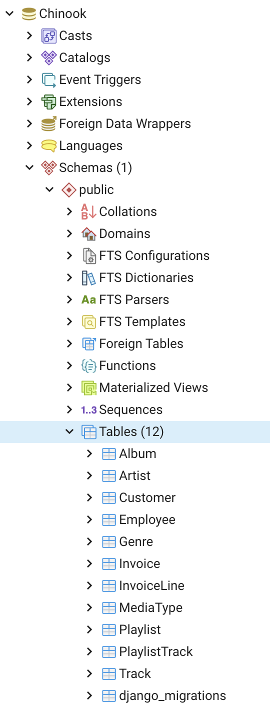

# django-legacy-database (sqlite and postgresql example)
Interface Django with a legacy (or existent) database without modifying it.

This is an quick example of multi-db support in django and a
demonstration of the inspectdb management command

The sample database comes from https://github.com/lerocha/chinook-database .
see the license for the included .sqlite database there.

The chinook app is the result of running the inspectdb command to
generate a models file and writng a router to handle my desired use
case where:

 - models from the required contrib apps (django related stuff) live in their own .sqlite db
 - but we create an admin to edit the (otherwise unmodified) chinook database

REF: https://www.protechtraining.com/blog/post/tutorial-using-djangos-multiple-database-support-477

For a quick and run, with sqlite : https://github.com/simeonf/django-dualdb-sample


- Another example:
https://datascience.blog.wzb.eu/2017/03/21/using-django-with-an-existinglegacy-database/
that uses this db : https://github.com/ghusta/docker-postgres-world-db/blob/master/scripts/world.sql

## Environment

Out of scope. But you should have a venv with django installed.

Tested with python 3.7 and Django 3.1
But any combination of compatible djangos should work

## Settings

Insert your DB  password into:

* settings file
* sql_scripts that change PK of a table

## Create dbs

```
# Create DB for django apps
❯ createdb -U postgres django-legacy-project

# Create legacy db and fill it with data
❯ createdb -U postgres Chinook
❯ psql -U postgres
Password for user postgres: 
psql (13.2, server 10.16)

postgres=# \l
                                   List of databases
         Name          |  Owner   | Encoding | Collate | Ctype |   Access privileges   
-----------------------+----------+----------+---------+-------+-----------------------
 Chinook               | postgres | UTF8     | C       | C     | 
```

Insert data

```
❯ psql -f tables_and_data.sql -q Chinook postgres
```

Check insert data on the command line (or you can use some tool like pgadmin o dbeaver)

```
postgres=# \c Chinook
psql (13.2, server 10.16)
You are now connected to database "Chinook" as user "postgres".

Chinook=# \dt+
                                 List of relations
 Schema |     Name      | Type  |  Owner   | Persistence |    Size    | Description 
--------+---------------+-------+----------+-------------+------------+-------------
 public | Album         | table | postgres | permanent   | 48 kB      | 
 public | Artist        | table | postgres | permanent   | 40 kB      | 
 public | Customer      | table | postgres | permanent   | 40 kB      | 
 public | Employee      | table | postgres | permanent   | 8192 bytes | 
 public | Genre         | table | postgres | permanent   | 8192 bytes | 
 public | Invoice       | table | postgres | permanent   | 72 kB      | 
 public | InvoiceLine   | table | postgres | permanent   | 144 kB     | 
 public | MediaType     | table | postgres | permanent   | 8192 bytes | 
 public | Playlist      | table | postgres | permanent   | 8192 bytes | 
 public | PlaylistTrack | table | postgres | permanent   | 336 kB     | 
 public | Track         | table | postgres | permanent   | 384 kB     | 
(11 rows)

Chinook=# select * from public."Artist";

```

## Multi-database setup

We need two databases: one for django.contrib.auth models and any other custom models we may have and one which is a legacy database whose creation/alteration we won't be managing with Django.

Django has [builtin support for multiple databases](https://docs.djangoproject.com/en/dev/topics/db/multi-db/). Basically we need to configure our settings to know about both our databases and then optionally build a database router that determines how data in particular apps and models ends up in a particular database.

Check settings to see how this was configured


## Generate models from legacy db

```
cd dualdb
./manage.py inspectdb --database=chinookdb > chinook/models.py
```


## Changes to modules

You can execute this commands to see changes to the auto generated models.

```
cd chinook
diff models.py models_unchanged.py
```

### Multiple PK fix

The Chinook database sensibly created a relationship table that has a multi-column primary key. The PlaylistTrack table has no single id column that serves as the primary key. However the Django ORM does not support multi-column keys and without a single primary key on the PlaylistTrack table the ORM has difficulty properly following the relationships between models.

There was a PlaylistTrack table without primary key.

```
Chinook=# SELECT table_name, column_name, data_type FROM information_schema.columns WHERE table_name = 'PlaylistTrack';
  table_name   | column_name | data_type 
---------------+-------------+-----------
 PlaylistTrack | PlaylistId  | integer
 PlaylistTrack | TrackId     | integer
(2 rows)
```

We can do some things to remmediate this:

1)
used sql in the sqlite shell to create a new table PlaylistTrack2 table just like PlayListTrack but with an additional id field that serves as a primary key. I copied all the records from the the original table to the new one, dropped the old table, and renamed PlaylistTrack2 to PlaylistTrack.

2) **DID NOT WORKED**
In recent versions of postgres, you can just add the column
```ALTER TABLE PlaylistTrack ADD COLUMN id SERIAL PRIMARY KEY;```
Because it has multiple column id defined!
```
Chinook=# ALTER TABLE public."PlaylistTrack" ADD COLUMN id SERIAL PRIMARY KEY;
ERROR:  multiple primary keys for table "PlaylistTrack" are not allowed
```
Obviously we've failed at our original mission - we've been forced to modify the structure of our database. This is the only change we've had to make, however, so we might be able to request this simple change to the database structure.


---------------------
Lets try 1

Connect to DB, and see table definition

```
$ psql -U postgres

postgres=# \c Chinook

Chinook=# \d+ public."PlaylistTrack";

                                 Table "public.PlaylistTrack"
   Column   |  Type   | Collation | Nullable | Default | Storage | Stats target | Description 
------------+---------+-----------+----------+---------+---------+--------------+-------------
 PlaylistId | integer |           | not null |         | plain   |              | 
 TrackId    | integer |           | not null |         | plain   |              | 
Indexes:
    "PK_PlaylistTrack" PRIMARY KEY, btree ("PlaylistId", "TrackId")
    "IFK_PlaylistTrackTrackId" btree ("TrackId")
Foreign-key constraints:
    "FK_PlaylistTrackPlaylistId" FOREIGN KEY ("PlaylistId") REFERENCES "Playlist"("PlaylistId")
    "FK_PlaylistTrackTrackId" FOREIGN KEY ("TrackId") REFERENCES "Track"("TrackId")
```

Execute modification script

```
python sql_scripts/02_migrate_playlistrack_id.py
```

See definition again, we should see the PK changed to a new id column:

```
Chinook=# \d+ public."PlaylistTrack";
                                 Table "public.PlaylistTrack"
   Column   |  Type   | Collation | Nullable | Default | Storage | Stats target | Description 
------------+---------+-----------+----------+---------+---------+--------------+-------------
 PlaylistId | integer |           | not null |         | plain   |              | 
 TrackId    | integer |           | not null |         | plain   |              | 
 id         | integer |           | not null |         | plain   |              | 
Indexes:
    "PK_PlaylistTrack" PRIMARY KEY, btree (id)
    "IFK_PlaylistTrackTrackId" btree ("TrackId")
Foreign-key constraints:
    "FK_PlaylistTrackPlaylistId" FOREIGN KEY ("PlaylistId") REFERENCES "Playlist"("PlaylistId")
    "FK_PlaylistTrackTrackId" FOREIGN KEY ("TrackId") REFERENCES "Track"("TrackId")
```

## Final configurations

See settings, and files inside chinook (admin for example) to see how everything ends.

Lets go with migrations.

Since the database connection is set up, we can start the initial database migration which will now only create the necessary Django tables using the default *database* alias.
Additionally we set up an initial admin site account:

```
❯ ./manage.py migrate

Operations to perform:
  Apply all migrations: admin, auth, contenttypes, sessions
Running migrations:
  Applying contenttypes.0001_initial... OK
  Applying auth.0001_initial... OK
  Applying admin.0001_initial... OK
  Applying admin.0002_logentry_remove_auto_add... OK
  Applying admin.0003_logentry_add_action_flag_choices... OK
  Applying contenttypes.0002_remove_content_type_name... OK
  Applying auth.0002_alter_permission_name_max_length... OK
  Applying auth.0003_alter_user_email_max_length... OK
  Applying auth.0004_alter_user_username_opts... OK
  Applying auth.0005_alter_user_last_login_null... OK
  Applying auth.0006_require_contenttypes_0002... OK
  Applying auth.0007_alter_validators_add_error_messages... OK
  Applying auth.0008_alter_user_username_max_length... OK
  Applying auth.0009_alter_user_last_name_max_length... OK
  Applying auth.0010_alter_group_name_max_length... OK
  Applying auth.0011_update_proxy_permissions... OK
  Applying auth.0012_alter_user_first_name_max_length... OK
  Applying sessions.0001_initial... OK

```

As we see, we do not have migrations for legacy db, so only django stuff is created.
Continue with admin

```
./manage.py createsuperuser
```

At this point if we run the server and go to the admin we are going to see everything!

--> See troubleshooting section

Let's do one more thing:

Although we don’t make any modifications to the database schema, we nevertheless have to generate an initial database migration file for the worlddata app so that Django knows the initial state of the models for optional later migrations:

```
❯ ./manage.py makemigrations chinook

Migrations for 'chinook':
  chinook/migrations/0001_initial.py
    - Create model Album
    - Create model Artist
    - Create model Customer
    - Create model Employee
    - Create model Genre
    - Create model Invoice
    - Create model Invoiceline
    - Create model Mediatype
    - Create model Playlist
    - Create model PlaylistTrack
    - Create model Track
```

We need to apply this migration now to the legacy database (alias world_data) so that Django knows the migration was run. However, no actual SQL commands should be executed because the tables already exist! We take this into account by using the --fake-initial switch:

```
❯ ./manage.py migrate --database chinookdb --fake-initial chinook

Operations to perform:
  Apply all migrations: chinook
Running migrations:
  Applying chinook.0001_initial... OK
```

This will also generate a django_migrations table in the legacy database — the only Django "system table" in this database.

**Now, go to the adin again, although it’s minimalist, it’s already fully functional: Each element in each table can be listed, modified, deleted and new elements can be added.**

See here how django_migrations was created in legacy db:




## Troubleshooting

**Befor applying fake initial migrations**:

If we go to the admin, if we want to create for example an Artist, we are going to see this:


But if we want to save it, we obtain this error:

# 


